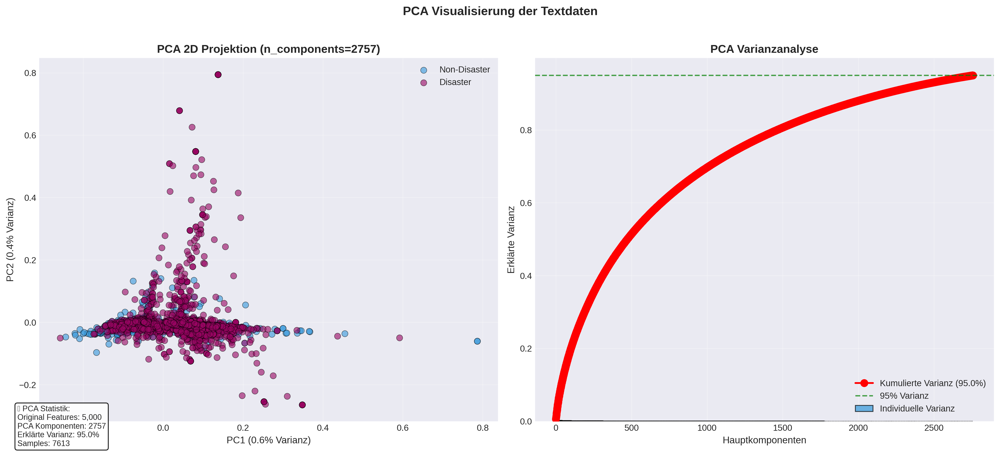

# 🚨 Disaster Tweet Classification

### End-to-End NLP Pipeline for Binary Tweet Classification

**Disaster vs. Non-Disaster Detection using Classical Machine Learning**

[](https://python.org)
[](https://scikit-learn.org)
[](LICENSE)
[](https://colab.research.google.com/drive/18pfgtM_4gbYDSLi68CeHcYzqc0vozaN9?usp=sharing)

**Author:** Guy M. Kaptue T. &nbsp;|&nbsp; [](https://github.com/guykaptue)

📄 **Full Academic Report:** [`reports/docs/disaster_tweet_report.pdf`](reports/docs/disaster_tweet_report.pdf)  
📓 **Reproducible Notebook:** [`notebook/katastrophen_Tweets.ipynb`](https://colab.research.google.com/drive/18pfgtM_4gbYDSLi68CeHcYzqc0vozaN9?usp=sharing)

---

<details open>
<summary><strong>📋 Table of Contents</strong></summary>

1. [Problem Statement](#-problem-statement)
2. [Project Objectives](#-project-objectives)
3. [Methodology](#-methodology)
4. [Project Structure](#-project-structure)
5. [Installation](#-installation)
6. [Usage](#-usage)
7. [Pipeline Walkthrough](#-pipeline-walkthrough)
8. [Results](#-results)
9. [Key Findings](#-key-findings)
10. [Limitations](#-limitations)
11. [Future Work](#-future-work)
12. [Acknowledgements](#-acknowledgements)

</details>

---

## 🎯 Problem Statement

Social media platforms — Twitter in particular — have become front-line communication channels during natural disasters, mass-casualty incidents, and other crises. Emergency services, NGOs, insurers, and journalists all need to rapidly identify genuine disaster reports from the overwhelming noise of everyday language.

The challenge is deceptively hard. Consider:

> *"On plus side LOOK AT THE SKY LAST NIGHT IT WAS ABLAZE"*

This describes a spectacular sunset, not a fire — yet a naive keyword model would flag it as a disaster. The inverse problem is equally dangerous: an actual wildfire report that uses understated language could be missed entirely.

This project addresses the **[Kaggle NLP with Disaster Tweets](https://www.kaggle.com/competitions/nlp-getting-started)** benchmark: given a tweet's text (and optional keyword/location metadata), automatically classify it as describing a **real disaster event** or **not**.

A 5–10% improvement in classification accuracy can translate to rescue operations being initiated **10–30 minutes earlier** — a potentially life-critical difference.

---

## 🏆 Project Objectives

| Priority | Objective | Target |
|----------|-----------|--------|
| **Primary** | Develop a robust binary classifier for disaster tweets | F1-Score ≥ 0.75 on held-out validation set |
| **Secondary** | Ensure full pipeline transparency and reproducibility | Every design decision justified by data |
| **Tertiary** | Derive actionable deployment recommendations | Business-ready production guidance |

---

## 🔬 Methodology

The solution follows a **six-phase, systematic NLP framework** — from raw CSV to a Kaggle-ready submission — using only classical machine learning (no deep learning).

```
RAW TWEETS  (7,613 training samples)
    │
    ▼
PHASE 1 ── Exploratory Data Analysis (EDA)
           Token frequency · Duplicate detection · Class distribution
           URL patterns · Structural feature profiling
    │
    ▼
PHASE 2 ── Text Preprocessing
           Duplicate & conflict resolution · Structural feature extraction (11 features)
           Tokenisation → Stopword filtering → Lemmatisation → Cleaning
    │
    ▼
PHASE 3 ── Vectorisation  (7 strategies)
           Sparse: TF-IDF Unigram / Bigram / Trigram · Count BOW Unigram / Bigram
           Dense:  Word2Vec (100d) · FastText (100d)
    │
    ▼
PHASE 4 ── Cross-Validation Study
           7 classifiers × 7 vectorisers = 49 combinations
           Stratified 5-Fold CV · Metrics: Accuracy, Precision, Recall, F1, AUC
    │
    ▼
PHASE 5 ── Hyperparameter Optimisation
           Best-per-vectoriser selection · RandomizedSearchCV (n_iter=30, 5-fold)
    │
    ▼
PHASE 6 ── Final Model Selection & Submission
           Validation-set F1 ranking · Kaggle submission generation
```

<details>
<summary><strong>Model Candidates (click to expand)</strong></summary>

| Model | Library | Configuration |
|-------|---------|---------------|
| Logistic Regression | scikit-learn | `class_weight='balanced'` |
| Naive Bayes (Multinomial) | scikit-learn | Sparse vectors only |
| Linear SVM | scikit-learn | `LinearSVC` |
| Random Forest | scikit-learn | 100 estimators |
| MLP (Neural Network) | scikit-learn | 2-layer feedforward |
| XGBoost | xgboost | `scale_pos_weight=1.35` |
| K-Nearest Neighbours | scikit-learn | — |

</details>

<details>
<summary><strong>Vectorisation Strategies (click to expand)</strong></summary>

| Strategy | Vocabulary | Sparsity | Dimension |
|----------|-----------|---------|----------|
| TF-IDF Unigram | 5,705 | 99.8% | 5,705 |
| TF-IDF Bigram | ~12,000 | 99.9% | ~12,000 |
| TF-IDF Trigram | 18,130 | 99.9% | 18,130 |
| Count BOW Unigram | 5,705 | 99.8% | 5,705 |
| Count BOW Bigram | ~12,000 | 99.9% | ~12,000 |
| Word2Vec (mean pooling) | 5,823 | 0% | 100 |
| FastText (mean pooling) | 5,823 | 0% | 100 |

</details>

---

## 📁 Project Structure

```
disaster_tweets_nlp_classification_project/
│
├── data/
│   ├── raw/
│   │   └── train.csv                          # Original Kaggle training data
│   └── processed/
│       ├── train_clean.csv                    # Cleaned training set
│       ├── train_preprocessed.csv             # Fully preprocessed (26 columns)
│       └── test_clean.csv                     # Cleaned test set
│
├── notebook/
│   └── katastrophen_Tweets.ipynb              # Complete reproducible pipeline
│
├── reports/
│   ├── docs/
│   │   └── disaster_tweet_report.pdf          # Full academic report
│   ├── models/
│   │   └── vectorizer/
│   │       ├── doc2vec/                       # Trained Doc2Vec models
│   │       └── vocabulary/                    # Saved vocabularies (JSON)
│   │           ├── tfidf/
│   │           ├── word2vec/
│   │           ├── doc2vec/
│   │           └── embedding_layer/
│   └── results/
│       ├── confusion_matrix.png
│       ├── confusion_matrix_with_metrics.png
│       ├── submission.csv                     # Kaggle submission file
│       ├── cv/                                # Cross-validation results (CSV/JSON/PKL)
│       └── plots/
│           ├── models/                        # CV heatmaps, ranking plots
│           ├── processor/                     # EDA visualisations, word clouds
│           └── vectorizer/                    # PCA, t-SNE, feature weight plots
│
└── README.md
```

---

## ⚙️ Installation

### Prerequisites

- Python 3.10 or higher
- Google Colab *(recommended)* or a local Jupyter environment
- Kaggle API credentials for dataset download

### Install Dependencies

```bash
pip install numpy pandas matplotlib seaborn plotly
pip install nltk wordcloud gensim
pip install scikit-learn xgboost
pip install kaggle
```

### Download NLTK Resources

```python
import nltk
nltk.download('punkt')
nltk.download('punkt_tab')
nltk.download('stopwords')
nltk.download('wordnet')
nltk.download('averaged_perceptron_tagger')
```

### Download Dataset via Kaggle API

```bash
# Ensure kaggle.json is placed at ~/.kaggle/kaggle.json
kaggle competitions download -c nlp-getting-started
unzip nlp-getting-started.zip -d data/raw/
```

---

## 🚀 Usage

Open `notebook/katastrophen_Tweets.ipynb` in **Google Colab** or a local Jupyter environment and execute all cells sequentially. The notebook is fully self-contained and annotated.

> **Note:** Update the `BASE_DIR` path at the top of the notebook to point to your project directory (Google Drive or local path).

<details>
<summary><strong>Step-by-Step Runtime Guide (click to expand)</strong></summary>

| Section | Description | Est. Runtime |
|---------|-------------|-------------|
| Section 3 | Package installation & setup | ~3 min |
| Section 4 | Exploratory Data Analysis | ~2 min |
| Section 5 | Text preprocessing | ~3 min |
| Section 6 | Vectorisation (7 methods) | ~10 min |
| Section 7.1 | Cross-validation study (49 combinations) | ~15–30 min |
| Section 7.6 | Hyperparameter tuning | ~20–40 min |
| Section 7.9 | Final prediction & Kaggle submission | ~1 min |

**Total estimated runtime:** 60–90 minutes on Google Colab (CPU).

</details>

<details>
<summary><strong>Quick Inference Example (click to expand)</strong></summary>

After training, load the saved model artefacts for inference on new tweets:

```python
import joblib
from preprocessing import TextPreprocessor

# Load artefacts
vectoriser = joblib.load('reports/models/count_bigram_vectoriser.pkl')
model      = joblib.load('reports/models/logreg_count_bigram_tuned.pkl')

# Preprocess & predict
preprocessor = TextPreprocessor()
clean = preprocessor.normalize("Wildfire spreading rapidly near highway 101")['clean_text']

X    = vectoriser.transform([clean])
prob = model.predict_proba(X)[0][1]
label = "🚨 DISASTER" if prob >= 0.5 else "✅ NON-DISASTER"
print(f"Prediction: {label}  (confidence: {prob:.2%})")
```

</details>

---

## 🔭 Pipeline Walkthrough

<details open>
<summary><strong>Phase 1 — Exploratory Data Analysis</strong></summary>

The EDA phase characterises the raw dataset across four dimensions:

- **Token frequency analysis** — Disaster tweets are dominated by event-oriented terms (`fire`, `police`, `earthquake`); non-disaster tweets by social language (`like`, `love`, `day`).
- **Duplicate detection** — 110 exact-text duplicates found in training data (some with conflicting labels); 20 in the test set.
- **Class distribution** — 57.4% Non-Disaster / 42.6% Disaster. Moderate imbalance; no aggressive resampling required.
- **URL analysis** — Disaster tweets contain URLs significantly more often (66.2% vs. 41.7%), predominantly `t.co` short-links.


</details>

<details>
<summary><strong>Phase 2 — Text Preprocessing</strong></summary>

The `TextPreprocessor` class implements a five-stage normalisation pipeline with full intermediate persistence:

```
raw_text
  → tokens              [word_tokenize · lowercase · URLs/mentions stripped]
  → tokens_no_stopword  [198-word stoplist; prepositions retained]
  → tokens_lemmatized   [WordNetLemmatizer]
  → tokens_cleaned      [min token length > 1 character]
  → clean_text          [final space-joined string]
```

In parallel, **11 structural features** are extracted from the raw text *before* normalisation: URL flags, hashtag counts, mention counts, character count, punctuation density, upper-case ratio. Combined with Top-30 keyword one-hot encoding, this produces a **42-dimensional structural feature matrix** appended to the text representation.


</details>

<details>
<summary><strong>Phase 3 — Vectorisation</strong></summary>

Seven text representation strategies are compared end-to-end. Sparse representations (TF-IDF / Count BOW) capture class-specific vocabulary directly; dense embeddings (Word2Vec, FastText) encode semantic similarity at the cost of mean-pooling signal dilution.




</details>

<details>
<summary><strong>Phase 4–5 — Cross-Validation & Hyperparameter Tuning</strong></summary>

All 49 model–vectoriser combinations are evaluated via **Stratified 5-Fold Cross-Validation**. The best candidate per vectoriser family is selected and fine-tuned with `RandomizedSearchCV` (30 iterations, 5-fold).


</details>

---

## 📊 Results

### Final Model Performance

| Metric | Value |
|--------|-------|
| **F1-Score (Validation)** | **0.7715** |
| **ROC-AUC (Validation)** | **0.8625** |
| Accuracy | 0.806 |
| Precision (Disaster class) | 0.81 |
| Recall (Disaster class) | 0.74 |

**Winner:** `Count Bigram × Logistic Regression`  
**Hyperparameters:** `solver=saga` · `penalty=l2` · `C=0.5` · `max_iter=2000`

---

### System Comparison

| Rank | System | F1 | AUC |
|------|--------|----|-----|
| 🥇 | Count Bigram × Logistic Regression *(final)* | **0.7715** | 0.8625 |
| 🥈 | TF-IDF Unigram × Logistic Regression | 0.7711 | **0.8661** |
| 🥉 | TF-IDF Unigram × Linear SVM | ~0.765 | ~0.855 |
| 4 | Word2Vec × Linear SVM | 0.743 | 0.852 |
| 5 | FastText × Linear SVM | 0.715 | 0.820 |

---

### Confusion Matrix


### Holdout Probability Distribution


---

## 💡 Key Findings

<details open>
<summary><strong>1. Simplicity outperforms complexity in this domain</strong></summary>

Logistic Regression with sparse Count/TF-IDF features **consistently outperforms** XGBoost, MLP, and Random Forest across all 49 experimental combinations. Three structural reasons explain this:

- **Short texts, high signal density.** Every word in a tweet carries proportionally more predictive weight than in long documents. Embedding mean-pooling averages out this signal.
- **Domain-specific vocabulary.** Disaster tweets occupy a clearly bounded lexical field. TF-IDF identifies class-specific terms with minimal noise.
- **Linear separability.** PCA visualisations confirm approximate linear separability in TF-IDF space, making non-linear decision boundaries unnecessary and counterproductive.

</details>

<details>
<summary><strong>2. Systematic evaluation is non-negotiable</strong></summary>

Without testing all 49 combinations, the intuitive default choice (XGBoost + FastText embeddings) would have been selected — but it performs **5.7% below** the actual best model. Data-driven model selection is essential.

</details>

<details>
<summary><strong>3. Interpretability and performance are not in conflict</strong></summary>

The best model is also the most explainable. Logistic Regression coefficients directly quantify each feature's contribution:

- **High-positive (Disaster):** `suicide bombing`, `wildfire`, `earthquake`, `casualty`
- **High-negative (Non-Disaster):** `lol`, `cute`, `beautiful`, `love`

This interpretability is critical for stakeholders operating in safety-critical or regulatory contexts.

</details>

---

## ⚠️ Limitations

<details>
<summary><strong>Data Limitations (click to expand)</strong></summary>

- **Temporal bias** — The dataset captures a specific historical period. Social media language evolves rapidly; performance may degrade without periodic retraining.
- **Label noise** — 110 duplicate tweets with conflicting labels were found and resolved; further annotation noise likely remains.
- **English only** — Disaster events in other languages are not covered by this pipeline.
- **Unknown inter-annotator agreement** — The original annotation protocol is undisclosed by Kaggle.

</details>

<details>
<summary><strong>Modelling Limitations (click to expand)</strong></summary>

- **Metaphorical language** — Expressions like *"the market is on fire"* or *"this performance was explosive"* systematically confuse bag-of-words models.
- **Irony and sarcasm** — *"I am literally dying from cringe"* cannot be resolved without contextual understanding.
- **No temporal or geospatial features** — Tweet timestamps, trending patterns, and geolocation are not utilised.
- **~23% error rate** — At F1 = 0.77, one in four tweets is misclassified, requiring human review workflows in production.

</details>

---

## 🔮 Future Work

| Priority | Direction | Expected Benefit |
|----------|-----------|-----------------|
| 🔴 High | Fine-tune `roberta-base` or `twitter-roberta-base` | F1 +5–10% (estimated ~0.83) |
| 🔴 High | Confidence-based 3-tier routing (auto / review / escalate) | Reduced false-alarm rate in production |
| 🟡 Medium | Threshold optimisation per stakeholder use-case | Tunable Recall/Precision trade-off |
| 🟡 Medium | Continuous retraining pipeline on live data | Sustained performance over time |
| 🟢 Low | Multilingual extension | Global disaster event coverage |
| 🟢 Low | Real-time streaming integration (Kafka / Kinesis) | Production deployment |

---

##  Acknowledgements

- **Author:** Guy M. Kaptue T. — [GitHub](https://github.com/guykaptue)
- **Dataset:** [Kaggle — Natural Language Processing with Disaster Tweets](https://www.kaggle.com/competitions/nlp-getting-started)
- **Core Libraries:** [scikit-learn](https://scikit-learn.org), [NLTK](https://www.nltk.org), [Gensim](https://radimrehurek.com/gensim/), [XGBoost](https://xgboost.readthedocs.io/)
- **Visualisation:** [Matplotlib](https://matplotlib.org/), [Seaborn](https://seaborn.pydata.org/), [Plotly](https://plotly.com/)

---

<p align="center">
  <b>© 2024 Guy M. Kaptue T. — All Rights Reserved</b><br>
  <i>Built with ❤️ and Python for the Kaggle NLP with Disaster Tweets Competition</i>
</p>

*For a full academic treatment — including statistical analysis, all visualisations, and formal methodology documentation — see [`reports/docs/disaster_tweet_report.pdf`](reports/docs/disaster_tweet_report.pdf).*